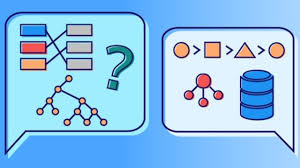

# Estructura de Datos Aplicadas

En este **repositorio** se encutra informacion de Estructura de Dtos en java, javascript y python

1. Conceptos Básicos
1. Arreglos
1. Listas Enlazadas
1. Pilas y Colas
1. Arboles Binarios

**Leonardo Isaac Barrera Tejeda**